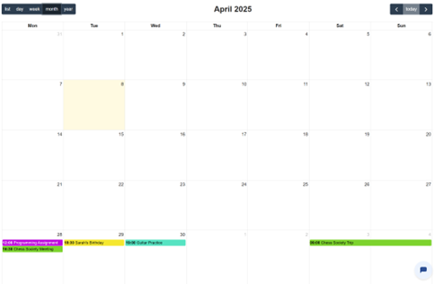
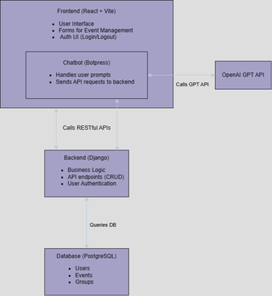

# DAyLI — AI-Powered Calendar & Task Management

> Final Year Project · TU Dublin BSc Computer Science · Awarded First Class Honours
>
> A full-stack web app combining a traditional calendar interface with a chatbot assistant that handles task and event management through natural language. Built between September 2024 and April 2025.
>
> [Final Report (PDF)](docs/Final_Report.pdf)

## What it does

DAyLI lets users manage their schedule two ways: through a standard graphical calendar interface, or by talking to a chatbot in plain English. Both paths hit the same backend APIs, so the chatbot is a genuine alternative to manual input rather than a bolted-on feature.

A user can either click into the calendar to add an event manually, or type *"Schedule a dentist appointment for next Tuesday at 3 PM"* — the chatbot extracts the entities, calls the relevant endpoint, and confirms back in natural language.

<p align="center">
  
</p>
<p align="center"><em>Calendar view with color-coded groups</em></p>

## Features

- **Email + password authentication** with a custom Django user model and Knox token-based sessions
- **Full CRUD** for events and groups, with strict per-user ownership enforcement on every endpoint
- **Color-coded groups** for organizing events, with client-side filtering by group
- **Chatbot assistant** (Botpress + OpenAI GPT) capable of creating, updating, deleting, and summarizing events through natural language
- **Form validation** with Yup on the frontend
- **Automated CI** — separate API and UI test pipelines running on every push

## Tech stack

- **Frontend:** React 18 + Vite, Material UI, Axios, Yup
- **Backend:** Django + Django REST Framework, Knox (token auth)
- **Database:** PostgreSQL (production), SQLite (development)
- **Chatbot:** Botpress with OpenAI GPT integration
- **Testing:** pytest / unittest (API), Robot Framework + Selenium (UI)
- **CI:** GitHub Actions
- **Hosting:** Render (backend, frontend, and managed Postgres)

## Architecture

<p align="center">
  
</p>
<p align="center"><em>The frontend, chatbot, and backend are independently deployable. The chatbot calls the same REST endpoints the manual UI does, so there's a single source of truth for business logic.</em></p>

## Running locally

### Backend

```bash
cd backend
python -m venv venv
source venv/bin/activate    # macOS/Linux
.\venv\Scripts\Activate     # Windows
pip install -r requirements.txt
python manage.py migrate
python manage.py runserver
```

API will be available at `http://localhost:8000`.

### Frontend

```bash
cd frontend
npm install
npm run dev
```

App will be available at `http://localhost:5173`.

### Tests

```bash
# API tests
cd tests/APITests
python tests.py

# UI tests (requires running app + Chrome)
cd tests/RobotTests
robot tests/tests.robot
```

## Project status

This was my final year project, submitted April 2025 and awarded First Class Honours. It's no longer actively maintained, but the codebase remains a as a portfolio piece.
